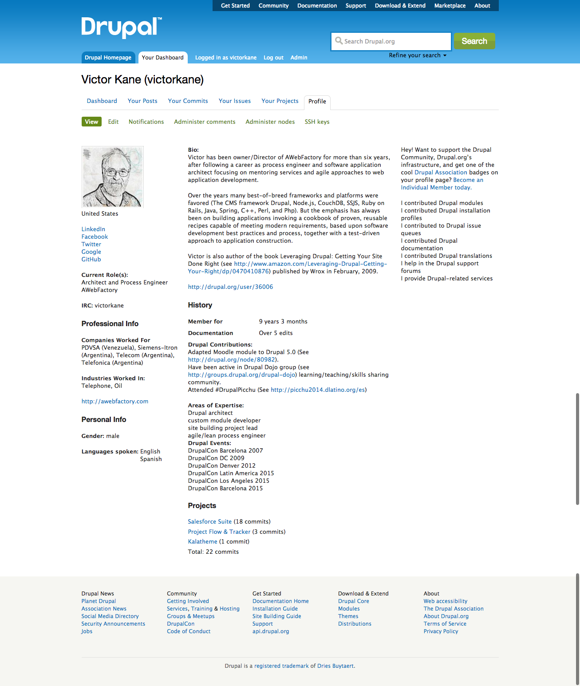
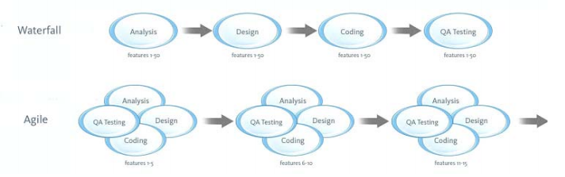
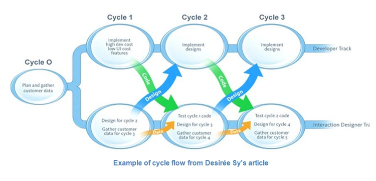
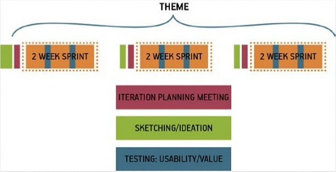
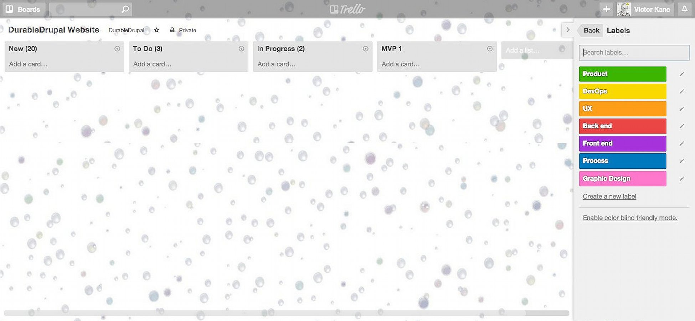
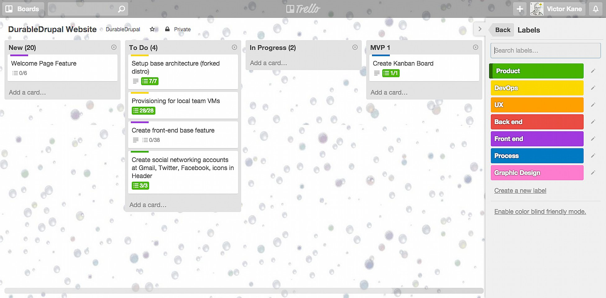

# Session

### Setting up a Reusable and DurableDrupal 
### Lean Process Factory
  
#### Victor Kane (AWebFactory.com)
  
DrupalCon Latin America 2015 / Bogotá, Colombia

<code>
$ whoami
</code>

<code>
[victorkane](https://www.drupal.org/user/36006)
</code>

## DurableDrupal Lean Process Factory 

Reusable tools and processes, tailored and in evolution, to finally defeat waterfall and guarantee delivered value

* Kanban (not Scrum)
* Project Inception and Vision
* Team Kickoff
* Development Workflow with Everything in Code
* DevOps, Server Provisioning and Deployment
* User Validation
Note:
That's a mighty phrase up there. If we understood it and knew how to get it done we could end this session right now and go have a beer. With your Lean Process Factory, how do you defeat rockstars, divas and waterfall and get the whole team working in parallel? How do you and your client together not stop until you are sure value has been delivered?

### Process Overview: Waterfall -> Agile

[From Desirée Sy's 2007 article Adapting Usability Investigations for Agile User-centered Design](http://uxpajournal.org/wp-content/uploads/pdf/agile-ucd.pdf)
Note:
The article explains how Waterfall and even Agile leads to the creation of isolated discipline silos where deliverables are implemented and then handed off to others without there being anywhere near enough cross-collaboration or feedback. Agile is an improvement over Waterfall since the abyss separating requirements gathering from testing is shorter and since the mini-cycles lend themselves to more testing and feedback taking place.

### Better Process (2007)

#### Cycle 0 + Staggered Sprints
Note:
In the article Sy and Miller go on to describe in detail their idea of productive integration of Agile and user-centered design using a technique called Cycle 0 (sometimes called Sprint 0 or Staggered Sprints), in which design activity takes place one sprint ahead of development.  Work is designed and validated during the “design sprint” and then passed off into the development stream to be implemented during the development sprint. Even though Sy and Miller always advocated strong collaboration between designers and developers, many teams have missed this critical point and have instead created workflows in which designers and developers still communicate by handoff, creating a kind of mini-waterfall process. But even when cross collaboration is encouraged, with staggered sprints it becomes very easy for the entire team to never be working on the same thing at the same time. You never realize the benefits of cross-functional collaboration because the different disciplines are most often focused on different things.

### Still better process: Design + Dev

(From Gothelf, Jeff (2013-02-22). Lean UX: Applying Lean Principles to Improve User Experience, O'Reilly Media)

Also see [Beyond Staggered Sprints: How TheLadders.com Integrated UX into Agile](http://johnnyholland.org/2010/10/beyond-staggered-sprints-how-theladders-com-integrated-ux-into-agile/)
Note:
Quote from Gothelf, Jeff (2013-02-22). Lean UX: Applying Lean Principles to Improve User Experience (p. 97). O'Reilly Media. Kindle Edition. 
Many teams have misinterpreted this model. Sy and Miller always advocated strong collaboration between designers and developers during both the design and development sprints. Many teams have missed this critical point and have instead created workflows in which designers and developers communicate by handoff, creating a kind of mini-waterfall process.

Themes help the prioritization of stories necessary to give designers time to be creative.

### Best Process: Design + Dev + DevOps

What we are adding here today to the mix is that just as it is critical for cross-collaboration between design and development, so it is just as critical for there to be cross-collaboration between design, development and DevOps, both in provisioning so that the team can really work in parallel, as well as in building, feedback conversations, testing and deployment.

### Waste Avoided by DurableDrupal Lean

1. Unfinished work left rotting in isolated silos
1. Feature creep without validating for impact or value
1. Isolated silos keep on re-inventing the wheel
1. Handoffs chronically disrupts workflow
1. Delays cuz isolated silos and teams missing skills
1. Task switching cuz work overload and broken workflow  
1. Mucho defect cuz chaotic focus and blocked knowledge sharing

Background article: [How to Manage the "7 Wastes" of Agile Software Development](https://www.scrumalliance.org/community/articles/2013/september/how-to-manage-the-7-wastes%E2%80%9D-of-agile-software-deve#sthash.AQrw03H3.dpuf) 

## Kanban

* **Kanban (not Scrum)**
* Project Inception and Vision
* Team Kickoff
* Development Workflow with Everything in Code
* DevOps, Server Provisioning and Deployment
* User Validation

### Kanban (not Scrum)

WIP (Work in Progress) is what makes Kanban unique

Note:
The main thing to understand about Kanban is that it is not based on the pre-estimated "sprints" designed to deliver a complete mini-release one finds when using Scrum. Rather it is a continuous flow process. Core jobs of work seeking a particular outcome are implemented one at a time in cross-collaboration, and their associated cards pass through various states (represented by columns) in the process. At the start all issues are placed in the New column (state). Then these are prioritized and a number of them are placed in the limited backlog "To Do" column.

### Kanban (not Scrum)

Note:
Then, when team members work on a job, it is placed in the "In Progress" or "Doing" column. This column is also limited in the number of issues it can contain. The reason for these constraints is key to why Kanban is different: it champions focus and prohibits people working on too many things at the same time. This is called a Work in Progress (WIP) limit, and it replaces the constraint of the sprint cycle length and time frame restrictions found in Scrum. In this way, Kanban frees us from waterfall-like mini-release "estimates". So while there are no sprints, only a continuous flow of jobs of work being delivered for outcome value testing, the WIP limit, seen in parenthesis in the To Do and In Progress column titles, seeks to optimize productivity without overload. The actual number is calculated by taking into account team size and velocity, and is adjusted for maximum productivity without overloading the team as the project matures. We limit the To Do column and the Doing column to 4 (number of separate disciplines being worked on with semi-paired programming).

## Project Inception and Vision

* Kanban (not Scrum)
* **Project Inception and Vision**
* Team Kickoff
* Development Workflow with Everything in Code
* DevOps, Server Provisioning and Deployment
* User Validation
Note:
Project Inception and Vision means that there has to be some starting point, based on inputs provided by the product owner (a client domain expert, marketing person, major stakeholder rep, etc.). These inputs  must be gathered as part of the more general preparation for the Project Team Kickoff in the form of a Vision text. 

### Online Literary Workshop Inception and Vision

* Gather all inputs: Client documentation, conversations, Legacy site and business context
* Create initial Project Vision text for team starting point
  * Detected pain points: who are experiencing them and what would they consider to be a solution?
  * List architecture alternatives: Frameworks, re-usable Drupal distros and other proven solutions
  * List initially detected constraints
* What team are we going to assemble for kickoff?
* Best way to provision team development and testing?
* Initial basic prototype as starting point for kickoff?

Note:
Everything needed for initial Project Kickoff, put together through cross-collaboration by the initial core team.

### Inputs for Online Literary Workshop Vision

* Product Owner must contribute to first cut of Market, Problem, Product definitions
  * Notes from phone conversations with stakeholders and users
  * Review of existing solutions (e-mail list)
  * Conversations with existing workshop members
    * Writers
    * Publishers
* Initial Team Core must gather:
  * Review of solution architecture alternatives
  * Any detectable constraints

Note:
The actual text is the responsibility of the Product Owner but will be done in cross-collaboration by the initial core team.

### Initial Online Literary Workshop Vision

[Vision Template](files/VisionTemplate.pdf)

[Online Literary Workshop Vision](files/OnlineLiteraryWorkshopVision.pdf)

Note:
The Vision will represent a first processing of product inputs and provide a starting point at the Kickoff for beginning to understand and validate problem, product and market in terms of value.

### Team Selection

* Anna (Product Owner)
* Jake (DevOps)
* Mark (UX)
* Jeff (Back end)
* Lisa (Front end)
* Victor (Project Coach)
* Sherrie (Graphic design)

Team selected on the basis of our Vision. Now, rather than "10x" rockstars, we have a 10x team who get to be productive thanks to cross-collaboration, communication, focus and teamwork. If the so-called 10x developer does emerge it is be by dint of working as part of a great team. 10x is a social team thing or it is nothing.

Note:
The Product Owner ideally comes from the client's organization, is responsable for creating and defending the Project Vision. Most important member of the team. If no-one is available from the client's organization... then don't do the project! Perspectives for failure are high. Seriously. If you absolutely want to go ahead anyway, you must use a courageous and outspoken proxy.

### Resources for Team Provisioning

* Ansible playbook for setting up DurableDrupalDistro locally with Vagrant and VirtualBox
  * On GitHub: [ansible-vagrant-durable-drupal-distro](https://github.com/DurableDrupal/ansible-vagrant-durable-drupal-distro)
  * On GitHub: [DurableDrupalDistro](https://github.com/DurableDrupal/durable-drupal-distro)
* [Create a Drupal project on Pantheon and pull it down to your laptop on Kalabox](http://awebfactory.com/node/521)
  * [Pantheon overview](https://pantheon.io/how-it-works)
  * [Pantheon workflow overview](https://pantheon.io/docs/articles/sites/code/using-the-pantheon-workflow/)
* [Setting up a local environment for a Drupal project on Platform.sh](https://docs.platform.sh/use-platform/getting-started-for-the-impatient/#how-to-set-up-your-local-drupal-development), click here for [more details](https://docs.platform.sh/use-platform/set-up-local-development/)
  * [Platform.sh overview](https://docs.platform.sh/use-platform/getting-started-for-the-impatient/)
  * [Platform.sh development workflow video](https://platform.sh/videos/2014/07/31/development-workflow/) additionally, [Environment workflow](https://docs.platform.sh/overview/platform-environments/)
  
<!--
* [Best = Free: Drupal Team Project Management tool based on latest Eclipse release](http://awebfactory.com/node/510)
* [Best = Free: Drupal IDE based on latest Eclipse release (Kepler)](http://awebfactory.com/node/509)
-->

### Prototype for Kickoff Starting Point?

In the absence of any legacy site, we will show how the email list is currently used for regular online literary workshop operations.

## Team Kickoff

* Kanban (not Scrum)
* Project Inception and Vision
* **Team Kickoff**
* Development Workflow with Everything in Code
* DevOps, Server Provisioning and Deployment
* User Validation

### Team Kickoff

* Every sprint has a kickoff, not just the first
* Everyone participates
* Domain experts are invited where needed
* May last a few hours or a week, whatever it takes

### What goes on at the Kickoff

Brainstorming and validation exercises which will enable the team to define a minimum viable product (MVP) as a set of user stories constituting the current backlog.

* Problems, Assumptions, Hypotheses
* Collaborative Design and Prototype towards Initial MVP
* MVP is the minimum release of the product capable of testing the hypotheses
* Once the MVP is defined, a subsequent Iteration Planning Meeting defines user story backlog

### Problems, Assumptions, Hypotheses

* Clarify problem statements
* List assumptions gleaned from the problem statements
* Prioritize assumptions in order to create hypotheses to test those assumptions
* Personas
* Feature brainstorming
Note:
"Our goal is not to create a deliverable, it’s to change something in the world — to create an outcome. We start with assumptions instead of requirements. We create and test hypotheses. We measure to see whether we’ve achieved our desired outcomes."

The MVP will be the minimum running product capable of testing the hypotheses. Later iterations will break the hypotheses down into sub-hypotheses as the final testable MVP emerges. 

### Problem Statement Template

[Our service/ product] was designed to achieve [these goals]. We have observed that the product/ service isn’t meeting [these goals], which is causing [this adverse effect] to our business. How might we improve [service/ product] so that our customers are more successful based on [these measurable criteria]?

### Problem Statement Example

Our service offers a conduit between job seekers and employers trying to hire them. Through our service, employers can reach out to job seekers in our ecosystem with employment opportunities. We have observed that one critical factor affecting customer satisfaction is how frequently job seekers respond to employer messages. Currently, job seekers are replying to these communications at a very low rate. How might we improve the efficacy of our communication products, thus making employers more successful in their jobs and job seekers more satisfied with our service?

### Hypothesis template

We believe [this statement is true]. We will know we’re [right/ wrong] when we see the following feedback from the market: [qualitative feedback] and/ or [quantitative feedback] and/ or [key performance indicator change].

### Hypothesis example

We believe that creating an efficient communication system within TheLadders’ product experience for recruiters and employers will achieve a higher rate of contact success and an increase in product satisfaction. We will know this is true when we see an increase in the number of replies from job seekers to recruiter contacts and an increase in the number of messages initiated by recruiters in our system.

### Sub-hypothesis template

We believe that [doing this/ building this feature/ creating this experience] for [these people/ personas] will achieve [this outcome]. We will know this is true when we see [this market feedback, quantitative measure, or qualitative insight].

The prioritized list of sub-hypotheses consitutes one of the most important results of the kickoff.

### Personas

 * Atavar or sketch, name, age, city, occupation, etc.
 * Behavorial demographic information
   * Marital status, Number of children, their ages, Working conditions, Leisure time, lifestyle, etc.
 * Pain points and needs
 * Potential solutions
 
Create Proto-personas, research this in the field to validate and develop. To do this research we need to "get out of the building" ([Steve Blank](http://steveblank.com/2010/03/11/teaching-entrepreneurship-%E2%80%93-by-getting-out-of-the-building/)) to test the problem statement and associated assumptions. Why take advice from an entreupeneur coach?

**Because every project is a start-up**!

### Feature brainstorming

Once we have personas with real problems that have been (ideally) researched and validated, we can brainstorm on features that will drive customer behavior towards the desired outcomes. We brainstorm and  create a list (stick them all up on the wall and then prioritize them).

**Features will be the basis for themes** (focused sets of sprints or work in progress on the basis of plenty of time for designer creativity and cross-collaboration).

### Collaborative Design and Prototype towards Initial MVP

#### Why and what

* Everybody gets to design together
* Low fidelity sketches and artifacts increase collaboration
* Methods such as group design studio build a shared understanding of features across the team

#### Methods and techniques

* Collective design studio
* Style guides and pattern libraries
* Special techniques for remote distributed teams

### Iteration Planning Meeting

The classic meeting using everything we've gathered together so far to write user stories (together) and specify the iteration backlog.

### User story template

Influenced by [A framework for modern User Stories by @jonatisokon](https://medium.com/@jonatisokon/a-framework-for-user-stories-bc3dc323eca9).

**Classic format**

As a [persona, user] I want to [perform action] so that [achievable goal].

**User validation test addendum**

Given that I'm [performing action] ... 
When [point of observation]
Then [observable result]

### User story example

As a writer I want to save my story so that it can be critiqued.

Given that I have saved my story
When I tap the save icon to save my story
Then saved to my stories and visible to fellow workshop members

### The goal of cross-collaboration

By the time the user stories are written for the current backlog, the whole team has been "kicked off" on each of them. A [short excerpt](files/lavidaenlean.txt) from Gothelf shows what collective development is like as the team works to complete the backlog. 

"This is the day-to-day rhythm of Lean UX: a team working collaboratively, iteratively, and in parallel, with few handoffs, minimal deliverables, and a focus on working software and market feedback."

## Development Workflow with Everything in Code

* Kanban (not Scrum)
* Project Inception and Vision
* Team Kickoff
* **Development Workflow with Everything in Code**
* DevOps, Server Provisioning and Deployment
* User Validation

## DevOps, Server Provisioning and Deployment

* Kanban (not Scrum)
* Project Inception and Vision
* Team Kickoff
* Development Workflow with Everything in Code
* **DevOps, Server Provisioning and Deployment**
* User Validation

## User Validation

* Kanban (not Scrum)
* Project Inception and Vision
* Team Kickoff
* Development Workflow with Everything in Code
* DevOps, Server Provisioning and Deployment
* **User Validation**

### Maximum 5 days until next User Validation

### Levels of Validation

* Unit tests and integration tests must be written by developer and run as part of automated frequent or continuous delivery
* Problem statement(s) validated by getting out of the building!
* Personas must be posited as proto-personas and validated and developed by... Getting out of the building
* User stories are validated via built in acceptance test (Given, When, Then)
* Hypotheses can only be run by testing users with the MVP
  * That's what the MVP is for
