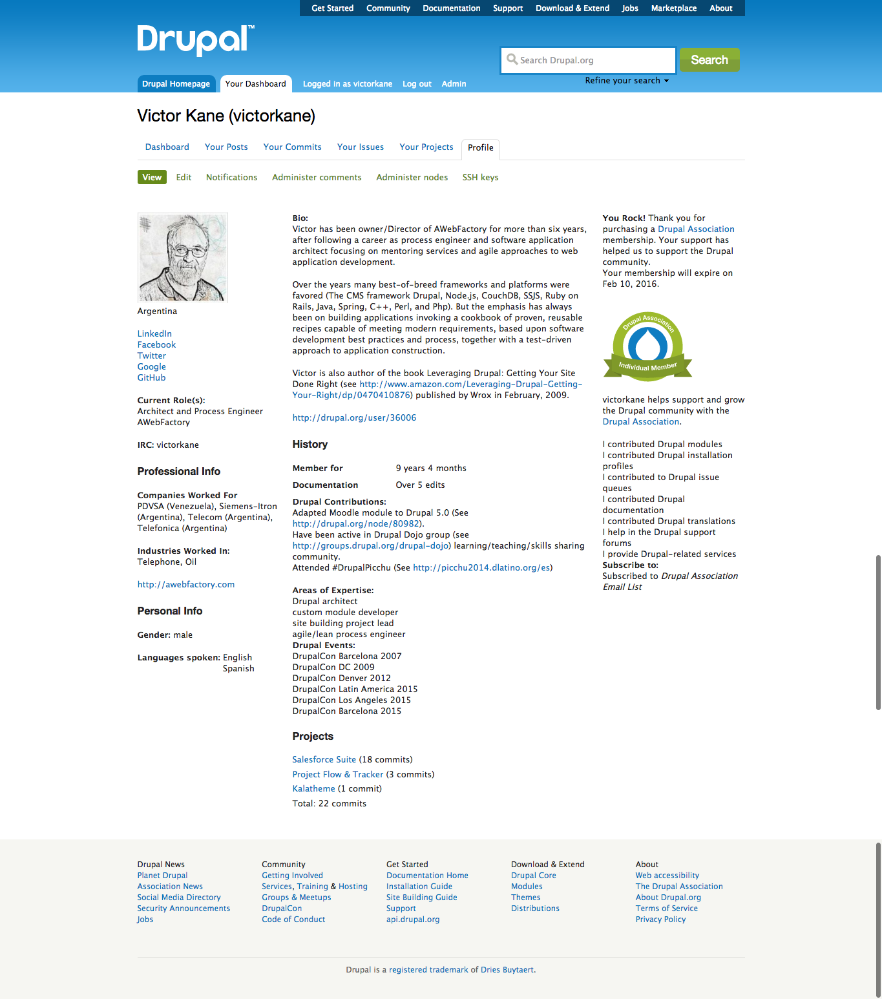

# Session

### Setting up a Reusable and DurableDrupal 
### Lean Process Factory
  
#### Victor Kane (AWebFactory.com)
  
DrupalCon Latin America 2015 / Bogotá, Colombia

<code>
$ whoami
</code>

<code>
[victorkane](https://www.drupal.org/user/36006)
</code>

## DurableDrupal Lean Process Factory 

Reusable tools and processes, tailored and in evolution, to finally defeat waterfall and guarantee delivered value

* Kanban (not Scrum)
* Project Inception and Vision
* Team Kickoff
* Assumptions, Hypotheses
* Design Studio and Prototype towards Initial MVP
* DevOps and Team Provisioning
* Development Workflow with Everything in Code
* DevOps, Server Provisioning and Deployment
Note:
That's a mighty phrase up there. If we understood it and knew how to get it done we could end this session right now and go have a beer. With your Lean Process Factory, how do you defeat rockstars, divas and waterfall and get the whole team working in parallel? How do you and your client together not stop until you are sure value has been delivered?

### Process Overview: Waterfall -> Agile

[From Desirée Sy's 2007 article Adapting Usability Investigations for Agile User-centered Design](http://uxpajournal.org/wp-content/uploads/pdf/agile-ucd.pdf)
Note:
The article explains how Waterfall and even Agile leads to the creation of isolated discipline silos where deliverables are implemented and then handed off to others without there being anywhere near enough cross-collaboration or feedback. Agile is an improvement over Waterfall since the abyss separating requirements gathering from testing is shorter and since the mini-cycles lend themselves to more testing and feedback taking place.

### Better Process (2007)

#### Cycle 0 + Staggered Sprints
Note:
In the article Sy and Miller go on to describe in detail their idea of productive integration of Agile and user-centered design using a technique called Cycle 0 (sometimes called Sprint 0 or Staggered Sprints), in which design activity takes place one sprint ahead of development.  Work is designed and validated during the “design sprint” and then passed off into the development stream to be implemented during the development sprint. Even though Sy and Miller always advocated strong collaboration between designers and developers, many teams have missed this critical point and have instead created workflows in which designers and developers still communicate by handoff, creating a kind of mini-waterfall process. But even when cross collaboration is encouraged, with staggered sprints it becomes very easy for the entire team to never be working on the same thing at the same time. You never realize the benefits of cross-functional collaboration because the different disciplines are most often focused on different things.

### Still better process: Design + Dev

(From Gothelf, Jeff (2013-02-22). Lean UX: Applying Lean Principles to Improve User Experience, O'Reilly Media)

Also see [Beyond Staggered Sprints: How TheLadders.com Integrated UX into Agile](http://johnnyholland.org/2010/10/beyond-staggered-sprints-how-theladders-com-integrated-ux-into-agile/)
Note:
Get description from page 97 (bookmarked)

### Best Process: Design + Dev + DevOps

What we are adding here today to the mix is that just as it is critical for cross-collaboration between design and development, so it is just as critical for there to be cross-collaboration between design, development and DevOps, both in provisioning so that the team can really work in parallel, as well as in building, feedback conversations, testing and deployment.

### Waste Avoided by DurableDrupal Lean

1. Unfinished work left rotting in isolated silos
1. Feature creep without validating for impact or value
1. Isolated silos keep on re-inventing the wheel
1. Handoffs chronically disrupts workflow
1. Delays cuz isolated silos and teams missing skills
1. Task switching cuz work overload and broken workflow  
1. Mucho defect cuz chaotic focus and blocked knowledge sharing

Background article: [How to Manage the "7 Wastes" of Agile Software Development](https://www.scrumalliance.org/community/articles/2013/september/how-to-manage-the-7-wastes%E2%80%9D-of-agile-software-deve#sthash.AQrw03H3.dpuf) 

## Kanban

* **Kanban (not Scrum)**
* Project Inception and Vision
* Team Kickoff
* Assumptions, Hypotheses
* Design Studio and Prototype towards Initial MVP
* DevOps and Team Provisioning
* Development Workflow with Everything in Code
* DevOps, Server Provisioning and Deployment

### Kanban (not Scrum)

WIP (Work in Progress) is what makes Kanban unique

Note:
The main thing to understand about Kanban is that it is not based on the pre-estimated "sprints" designed to deliver a complete mini-release one finds when using Scrum. Rather it is a continuous flow process. Core jobs of work seeking a particular outcome are implemented one at a time in cross-collaboration, and their associated cards pass through various states (represented by columns) in the process. At the start all issues are placed in the New column (state). Then these are prioritized and a number of them are placed in the limited backlog "To Do" column.

### Kanban (not Scrum)

Note:
Then, when team members work on a job, it is placed in the "In Progress" or "Doing" column. This column is also limited in the number of issues it can contain. The reason for these constraints is key to why Kanban is different: it champions focus and prohibits people working on too many things at the same time. This is called a Work in Progress (WIP) limit, and it replaces the constraint of the sprint cycle length and time frame restrictions found in Scrum. In this way, Kanban frees us from waterfall-like mini-release "estimates". So while there are no sprints, only a continuous flow of jobs of work being delivered for outcome value testing, the WIP limit, seen in parenthesis in the To Do and In Progress column titles, seeks to optimize productivity without overload. The actual number is calculated by taking into account team size and velocity, and is adjusted for maximum productivity without overloading the team as the project matures. We limit the To Do column and the Doing column to 4 (number of separate disciplines being worked on with semi-paired programming).

## Project Inception and Vision

* Kanban (not Scrum)
* **Project Inception and Vision**
* Team Kickoff
* Assumptions, Hypotheses
* Design Studio and Prototype towards Initial MVP
* DevOps and Team Provisioning
* Development Workflow with Everything in Code
* DevOps, Server Provisioning and Deployment
Note:
Project Inception and Vision means that there has to be some starting point, based on input from the client and a first processing of that input (which may have come from a full RFP round trip or simply a telephone conversation) into something that begins to understand the problem, product and market in terms of value and performs all preparation necessary for the Team Kickoff for the project.

### Project Inception and Vision

* Gather all inputs: Client documentation, conversations, Legacy site and business context
* Create initial Project Vision text for starting point
  * For each detected pain point
    * Who is experiencing it?
    * What solutions would ease their pain?
  * List architecture alternatives: Frameworks, re-usable Drupal distros and other past solutions
* What team are we going assemble for kickoff?
* What provisioning might be best for development and testing?
* Possibility of initial basic prototype as starting point for kickoff    

### Inputs for Online Literary Workshop Project

* Notes from phone conversation with client
* Review of existing solutions (e-mail list)
* Conversations with existing workshop members
  * Writers
  * Publishers
* Review of solution architecture alternatives

### Initial Online Literary Workshop Vision

<< pdf attachment >>

### Team Selection

* Anna (Product Owner)
* Jake (DevOps)
* Mark (UX)
* Jeff (Back end)
* Lisa (Front end)
* Victor (Project Coach)
* Sherrie (Graphic design)

And none of them are "10x" rockstars: it's just a team of knowledge workers who are going to be 10x productive as a team because they will enjoy permanent communication and an optimum task focus.

### Resources for Team Provisioning

* Ansible playbook for setting up the DurableDrupalDistro on local workstation using Vagrant and VirtualBox
  * On GitHub: [ansible-vagrant-durable-drupal-distro]()
  * On GitHub: [DurableDrupalDistro](https://github.com/DurableDrupal/durable-drupal-distro)

### Prototype for Kickoff Starting Point?

In the absence of any legacy site, we will show how the email list is currently used for regular online literary workshop operations.

## Team Kickoff

* Kanban (not Scrum)
* Project Inception and Vision
* **Team Kickoff**
* Assumptions, Hypotheses
* Design Studio and Prototype towards Initial MVP
* DevOps and Team Provisioning
* Development Workflow with Everything in Code
* DevOps, Server Provisioning and Deployment

## Assumptions, Hypotheses

* Kanban (not Scrum)
* Project Inception and Vision
* Team Kickoff
* **Assumptions, Hypotheses**
* Design Studio and Prototype towards Initial MVP
* DevOps and Team Provisioning
* Development Workflow with Everything in Code
* DevOps, Server Provisioning and Deployment

## Design Studio and Prototype towards Initial MVP

* Kanban (not Scrum)
* Project Inception and Vision
* Team Kickoff
* Assumptions, Hypotheses
* **Design Studio and Prototype towards Initial MVP**
* DevOps and Team Provisioning
* Development Workflow with Everything in Code
* DevOps, Server Provisioning and Deployment

## DevOps and Team Provisioning

* Kanban (not Scrum)
* Project Inception and Vision
* Team Kickoff
* Assumptions, Hypotheses
* Design Studio and Prototype towards Initial MVP
* **DevOps and Team Provisioning**
* Development Workflow with Everything in Code
* DevOps, Server Provisioning and Deployment

## Development Workflow with Everything in Code

* Kanban (not Scrum)
* Project Inception and Vision
* Team Kickoff
* Assumptions, Hypotheses
* Design Studio and Prototype towards Initial MVP
* DevOps and Team Provisioning
* **Development Workflow with Everything in Code**
* DevOps, Server Provisioning and Deployment

## DevOps, Server Provisioning and Deployment

* Kanban (not Scrum)
* Project Inception and Vision
* Team Kickoff
* Assumptions, Hypotheses
* Design Studio and Prototype towards Initial MVP
* DevOps and Team Provisioning
* Development Workflow with Everything in Code
* **DevOps, Server Provisioning and Deployment**
